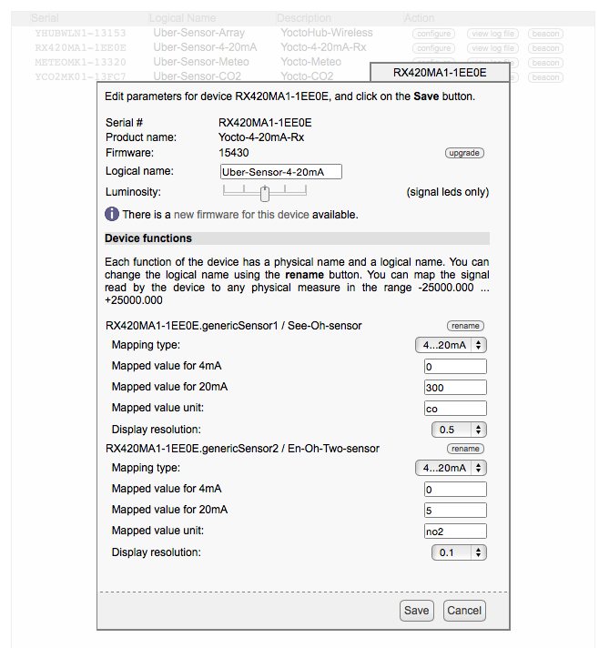

# homespun
This is the root of the homespun family of repositories:
you run a server in your home that collects sensor readings and uploads them to the management cloud of your choice.
At present,
upload to only one cloud is available:
[numerous](http://numerousapp.com/).
It is meant to be easy to add support for other clouds.

Note that this repository does not have either the "Issues" or "Wiki" sections --
if you want to discuss the homespun framework,
please send an email to the [maintainer](mailto:mrose17@homespun.io)
requesting to be added to the [homespun team](https://homespun-io.slack.com).
Or, send an SMS to the [homespun hotline](sms:+1-747-2022294).

## Theory of Operation
In your home,
you connect sensors to either a micro-controller (e.g., an [Arduino](https://www.arduino.cc))
or a micro-processor (e.g., a [Raspberry Pi](https://www.raspberrypi.org),
[BeagleBone Black](http://beagleboard.org/black),
or [BeagleBone Green](http://www.seeed.cc/beaglebone_green)).
Sensor readings are then sent to an "always-on" computer termed a "sensor platform".
The sensor platform then uploads these readings to a management cloud,
which can then be monitored, used as triggers for robots, and so on.

The sensor platform can be either an "always-on" spare computer such as a dedicated micro-processor.
The sensor platform should **never** be your desktop computer or a computer that isn't always on or has poor network access.

Here is an end-to-end example:

            +--------------+ +--------------------+            +-----------------------+
            |    sensor    |-|  micro-controller  |  talks to  |   sensor platform     |
            |              |-|                    |  ------->  |                       |
            |  e.g. TMP36  |-|   e.g., Arduino    |            |   running homespun    |
            +--------------+ +--------------------+            +-----------------------+
                                                                           |
        home network                                                       |
        --------------------------------------------------------------------------------
        the Internet                                                       |
                                                                           |
                                                                          \|/
                                                                 +--------------------+
                                                                 |     the cloud      |
                                                                 +--------------------+
                                                                          /|\
                                                                           |
                                                                           |
                                                                          \|/
                                                                 +--------------------+
                                                                 |     cloud app      |
                                                                 +--------------------+

There are many ways to [connect a sensor](http://playground.arduino.cc/Main/InterfacingWithHardware#Input)
to an Arudino.
In many cases,
you'll use a _shield_.
There are many sources of Arduino-compatible [shields](http://shieldlist.org).
There are also several good sources for shields and sensors,
e.g., [Maker Shed](http://www.makershed.com/collections/arduino-shields-accessories),
[Adafruit](https://www.adafruit.com/category/21),
and [Seeed Studio](http://www.seeedstudio.com/depot/Shield-t-2.html).

An alternative architecture is to attach the sensor directly to the sensor platform,
and have `homespun` read directly from the GPIO pins or the USB port:

                             +---------------+ +-----------------------+
                             |    sensor     |-|   sensor platform     |
                             |               |-|                       |
                             |  e.g., TMP36  |-|   running homespun    |
                             +---------------+ +-----------------------+
                                                           |
        home network                                       |
        ----------------------------------------------------------------
        the Internet                                       |
                                                           |
                                                          \|/
                                                 +--------------------+
                                                 |     the cloud      |
                                                 +--------------------+
                                                          /|\
                                                           |
                                                           |
                                                          \|/
                                                 +--------------------+
                                                 |     cloud app      |
                                                 +--------------------+

For the Raspberry Pi,
you may want use a _shield_ to connect a sensor.
There are many sources of RPi-compatible [shields](http://elinux.org/RPi_Expansion_Boards).
There are also several good sources for shields and sensors,
e.g., [Maker Shed](http://www.makershed.com/collections/raspberry-pi-shields-accessories),
[Adafruit](https://www.adafruit.com/category/35),
[Dexter Industries](http://www.dexterindustries.com/shop/grovepi-board/),
[MikroElectronika](http://www.mikroe.com/click/pi2-shield/),
and [Seeed Studio](http://www.seeedstudio.com/depot/Sensors-c-25/).

For the BeagleBone Black,
generally you'll use a _cape_ to connect a sensor.
When looking at the [list of capes](http://elinux.org/Beagleboard:BeagleBone_Capes)
keep in mind that not all are compatible with the BB Black.
Several of these capes support multiple sensors.
For example,
the [mikroBUS cape](http://beagleboard.org/project/mikrobus) supports over a hundred different
[click boards](http://www.mikroe.com/click/).

There is a [Grove Cape](http://www.seeedstudio.com/depot/Grove-Cape-for-BeagleBone-Series-p-1718.html) for the BeagleBone
series,
that has six connectors for the [Grove family of sensors](http://www.seeedstudio.com/wiki/Grove_System/).
Alternatively,
the BeagleBone Green comes with two onboard Grove connectors!

If you're interested in USB sensors,
[Yoctopuce](http://www.yoctopuce.com) makes a wide range of _prosumer_ (Swiss-made) sensors:

* [Environmental](http://www.yoctopuce.com/EN/products/category/usb-environmental-sensors)
* [Electrical](http://www.yoctopuce.com/EN/products/category/usb-electrical-sensors)
* [Electrical Interfaces](http://www.yoctopuce.com/EN/products/category/usb-electrical-interfaces)
* [Positional](http://www.yoctopuce.com/EN/products/category/usb-position-sensors)

You can also plug the Yoctopuce sensors into an Ethernet or Wi-Fi hub to make the readings available on your local network.

Finally,
you may already have a sensor in your home that talks to a third-party cloud service,
If the vendor already has a consumer API,
you could use this architecture:

            +--------------+                                   +-----------------------+
            |    sensor    |    talks to          talks to     |   sensor platform     |
            |              |  ------------+    +-------------  |                       |
            |  e.g. TMP36  |              |    |               |   running homespun    |
            +--------------+              |    |               +-----------------------+
                                          |    |                            |
        home network                      |    |                            |
        --------------------------------------------------------------------------------
        the Internet                      |    |                            |
                                          |    |                            |
                                         \|/  \|/                          \|/
                                     +----------------+           +-------------------+
                                     | vendor's cloud |           |     the cloud     |
                                     +----------------+           +-------------------+
                                                                           /|\
                                                                            |
                                                                            |
                                                                           \|/
                                                                  +-------------------+
                                                                  |     cloud app     |
                                                                  +-------------------+

## Installation
To begin,
you will need to have [Node.js](https://nodejs.org) running on a _sensor platform_.

Node.js is available on many, many different computing platforms.
If you are familiar with JavaScript,
then you can learn to program in Node.js very quickly --
and if you aren't familiar with JavaScript,
you can become familiar with it easily.

### Get a sensor platform
If you are starting from scratch,
you have many excellent options.
Here's one:
the [Raspberry Pi 2 Model B](https://www.raspberrypi.org/products/raspberry-pi-2-model-b/).
For less than USD40,
you get a very powerful, very small ARM-A7 computer.
When you purchase the RPi2 model B,
you will probably have the option of also purchasing a Micro SD card containing the filesystem.
One option is a [4GB SD card with Raspian Wheezy](http://www.adafruit.com/products/1121) already installed.

The next step is to configure an RPi for secure local access and install Node.js and `node-gyp`.
The instructions are [here](https://github.com/mrose17/homespun/blob/master/RPi.md).

### Install homespun
Go to the directory where you have downloaded [homespun](https://github.com/mrose17/homespun/archive/master.zip)
and run `npm -l install`:

        pi@raspberrypi ~ $ cd homespun-master/
        pi@raspberrypi ~/homespun-master $ npm -l install
        ...

## Management Clouds
_To be documented once the `configurator` is implemented._

For now,
create a file called `datastore/clouds/numerous.json`.
Here is what it should contain:

        [
          {
            "cloud"       : "numerous",
            "id"          : 1,
            "server"      : "https://api.numerousapp.com/",
            "api_key"     : "..."
          }
        ]

You can determine the value of `apiKey` by running the `numerous` mobile application and looking under 
`Settings > Developer Info`.

## Supported Sensor Drivers
`homespun` comes with some pre-written sensor drivers to help you get started!

It is easiest to integrate using [TSRP](http://thethingsystem.com/dev/Thing-Sensor-Reporting-Protocol.html).
At present,
there are two repositories that contain TSRP transcoders:

* [homespun-arduino](https://github.com/mrose17/homespun-arduino), which contains examples sketches for the
[Arduino Ethernet](https://www.arduino.cc/en/Main/ArduinoBoardEthernet); and,

* [homespun-grovepi](https://github.com/mrose17/homespun-grovepi), a Node.js module for the
[Raspberry Pi](https://www.raspberrypi.org) and a [GrovePi+ Shield](http://www.dexterindustries.com/shop/grovepi-board/).

`homespun` also knows how to [talk to Yoctopuce sensors].

It also knows how to talk to the 
[CubeSensors](https://cubesensors.com),
[Foobot](http://foobot.io),
and
[Netatmo](https://www.netatmo.com/en-US/product/weather-station)
clouds,
although configuration isn't automated as it is with the TSRP and Yoctopuce drivers.

### TSRP
First read this [file](examples/README.md).

The easiest way to integrate your sensor with `homespun` is to have write code that reads the sensor value and uses 
the [TSRP](http://thethingsystem.com/dev/Thing-Sensor-Reporting-Protocol.html) to report values.
Take a look at the examples for the [Arduino](examples/arduino/README.md)
and for the [GrovePi](examples/grove-pi/README.md).

For example,
looking at [Arduino example](examples/arduino/WaterSensor)
you'll see a file called `WaterSensor.ino` -- this is an Arduino _sketch_ file (a program),
that is compiled with the Arduino [IDE](https://www.arduino.cc/en/Guide/Environment).
It expects that digital pin 7 is connected to
a [Grove Water Sensor](http://www.seeedstudio.com/depot/Grove-Water-Sensor-p-748.html).
You can either connect the sensor directly or using a
[Grove Shield](http://www.seeedstudio.com/wiki/Grove_-_Base_Shield_V1.3) for the Arduino.

The sketch starts by getting a DHCP address for the Arduino,
it prints out the MAC and IP addresses,
and then opens up the multicast UDP port for TSRP.
It reads from pin D7 and constructs a TSRP packet that is then multicast to the local network.
The TSRP driver for `homespun` listens for these packets,
transcodes them into a format suitable for the configured cloud,
and then uploads them.

The [GrovePi example](examples/grove-pi) is a little more complicated.
It expects that you have a Raspberry Pi with a [GrovePi+ Shield](http://www.dexterindustries.com/shop/grovepi-board/).
A configuration file (`config.json`) tells the program (`multi-sensor.js`) what sensor is on each port -- in this case,
pin D7 also has a Grove Water Sensor.

### Yoctopuce
[Yoctopuce](http://www.yoctopuce.com) makes a wide range of _prosumer_ (Swiss-made) sensors.
You can either plug them into the USB ports on your sensor platform and run a program called
[VirtualHub](https://www.yoctopuce.com/EN/virtualhub.php) that makes them available,
or you can attach them to a Yoctopuce Ethernet or Wi-Fi hub to make the readings available on your local network.
Either way,
`homespun` will automatically discover the sensors and report their values.

At present,
any sensors reporting this values are supported:

    altitude, co, co2, humidity, light, no2, pressure, temperature, voc

If you are using either the [Yocto-0-10V-Rx](https://www.yoctopuce.com/EN/products/usb-electrical-interfaces/yocto-0-10v-rx)
or [Yocto-4-20mA-Rx](https://www.yoctopuce.com/EN/products/usb-electrical-interfaces/yocto-4-20ma-rx)
to read an industrial sensor following either of these two standards,
then you **must** set the `Mapped value unit` to reflect what is being measured.
In this example,
the leads for `genericSensor1` are connected to a `co` sensor,
and the leads for `genericSensor2` are connected to a `no2` sensor:

Optionally,
you can also define the `Logical name` of each sensor.
In the example above,
the logical name is `Uber-Sensor-4-20mA`.

### SNMP
Although the [Simple Network Management Protocol](https://en.wikipedia.org/wiki/Simple_Network_Management_Protocol)
is intended for managing networks,
some vendors make sensor information available using this protocol.

At present,
`homespun` supports only the [ServersCheck](https://serverscheck.com) sensors.
Take a look at `drivers/driver-snmp.js` to see how dispatch is done based on the `sysObjectID` of the SNMP agent.

### CubeSensors
_To be documented once the `configurator` is implemented._

### Foobot
_To be documented once the `configurator` is implemented._

### Netatmo
_To be documented once the `configurator` is implemented._

## Measurement Taxonomy
The homespun family divides the "sensor world" into three parts:
unit-based,
percentage-based,
.σ-based.

### Unit-based
Unit-based sensors report values that are based on some kind of standardized metric:

|property|SI or derived units|expressed using|
|-|-|
|altitude|meters|float|
|airflow|meters/second|float|
|co|ppm|float|
|co2|ppm|float|
|distance|meters|float|
|gustheading|degrees|float|
|gustvelocity|meters/second|float|
|hcho|ppm|float|
|hydrogen|ppm|float|
|light|lux|float|
|location|coordinates|quad|
|methane|ppm|float|
|no|ppm|float|
|no2|ppm|float|
|noise|decibels|float|
|particles.2_5|micrograms/cubicmeters|float|
|particulates|particles/cubicmeters|float|
|pH|pH|float|
|pressure|millibars|float|
|rainfall|millimeters|float|
|smoke|ppm|float|
|temperature|celcius|float|
|uvi|uv-index|float|
|vapor|ppm|float|
|velocity|meters/second|float|
|voc|ppm|float|
|windheading|degrees|float|
|windvelocity|meters/second|float|

### Percentage-based or Boolean-based
Percentage-based sensors report values that are based on a ratio,
either as a `float` in the range 0.0 to 1.0, or as a boolean.
In the case of a ratio,
the value being reported refers to the sensor's reporting range:

|property|expressed using|
|-|-|
|aqi|percentage|
|battery|percentage|
|brightness|percentage|
|flame_detected|boolean|
|humidity|percentage|
|liquid_detected|boolean|
|moisture|percentage|
|motion|boolean|
|opened|boolean|
|powered|boolean|
|pressed|boolean|
|signal|percentage|
|sonority|percentage|
|tamper_detected|boolean|
|vibration|boolean|

### σ-based
Sensors that report uncalibrated data,
are useful only in the context of previous data.
These raw values are reported directly (typed as "epsilon")
which transcodes them into standard deviation values that are uploaded to the management cloud (typed as "sigmas"):

|property|raw value|
|-|
|aqi.σ|aqi.ε|
|co.σ|co.ε|
|co2.σ|co2.ε|
|flow.σ|flow.ε|
|gas.σ|gas.ε|
|hcho.σ|hcho.ε|
|hydrogen.σ|hydrogen.ε|
|methane.σ|methane.ε|
|no.σ|no.ε|
|no2.σ|no2.ε|
|smoke.σ|smoke.ε|
|vapor.σ|vapor.ε|
